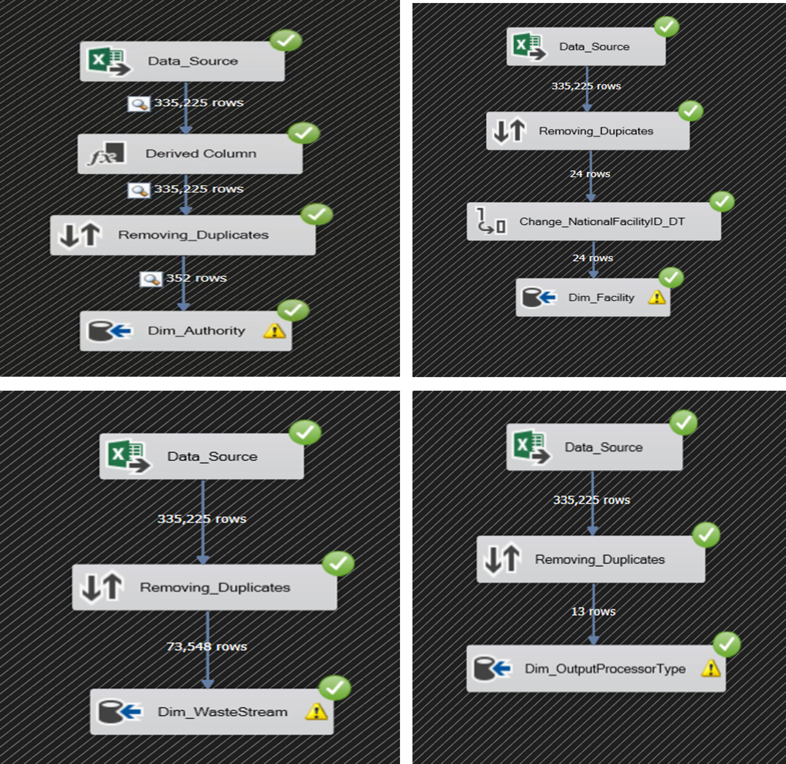
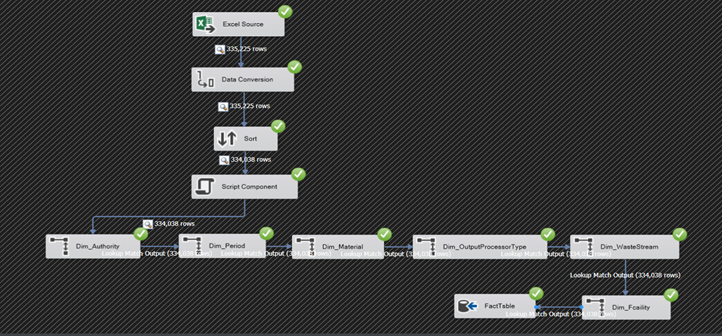
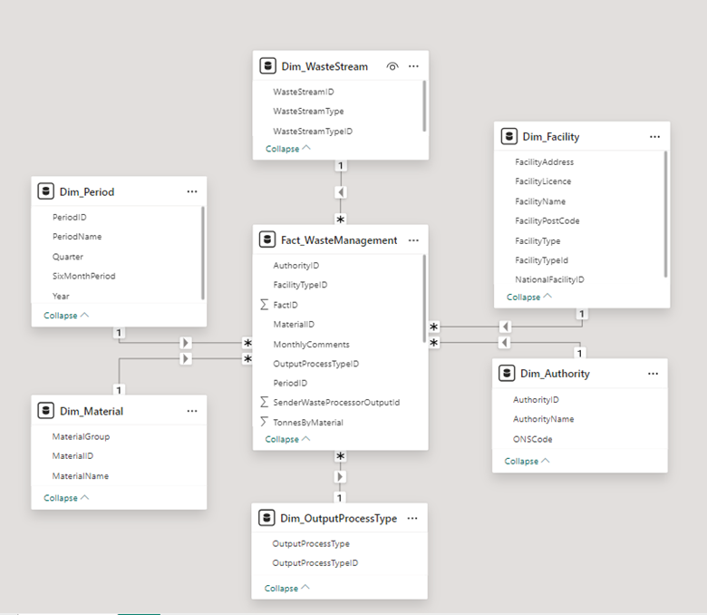
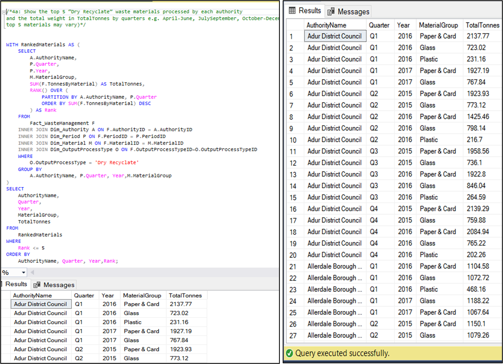
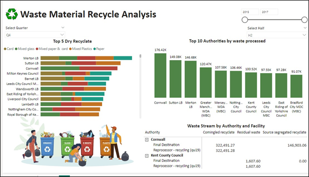

# 📊 Waste Management Data Warehouse & ETL Pipeline (SSIS + SQL Server + Power BI)

## 🚀 Project Overview

This project presents an end-to-end **data engineering solution** involving the design and implementation of a **data warehouse** and **ETL pipeline** using real-world structured datasets.

The solution focuses on transforming inconsistent raw data into a unified, analytics-ready format to support **data-driven decision-making**. The project demonstrates strong capabilities in **data cleaning, transformation, warehousing, and visualization**.

---

## 🎯 Objectives

* Design a scalable **data warehouse** using dimensional modeling (Star Schema)
* Build an **ETL pipeline using SSIS** to extract, transform, and load data
* Handle **data inconsistencies** such as missing values and schema mismatches
* Perform **analytical queries using SQL**
* Develop **interactive dashboards** for business insights using Power BI

---

## 🛠️ Tools & Technologies

* **SQL Server** – Data warehouse implementation
* **SSIS (SQL Server Integration Services)** – ETL pipeline
* **SSMS (SQL Server Management Studio)** – Querying & database management
* **Power BI** – Data visualization & dashboarding
* **Visual Studio** – SSIS package development

---

## ⚙️ Data Engineering Workflow

### 🔹 1. Data Extraction

* Collected data from multiple structured source files
* Identified inconsistencies across datasets

### 🔹 2. Data Cleaning & Transformation

* Resolved **column mismatches** between datasets
* Handled **null and missing values**
* Standardized schema for compatibility
* Removed duplicate and irrelevant fields

### 🔹 3. ETL Pipeline (SSIS)

* Built SSIS data flows for:

  * Data extraction
  * Transformation (Derived Columns, Data Conversion)
  * Data merging (Union operations)
* Implemented **lookup transformations** to maintain referential integrity

### 🔹 4. Data Warehouse Design

* Designed a **Star Schema** using Kimball methodology

#### ⭐ Fact Table:

* `Fact_WasteManagement` – stores quantitative metrics (e.g., total tonnage)

#### 📂 Dimension Tables:

* `Dim_Authority`
* `Dim_Period`
* `Dim_Material`
* `Dim_Facility`
* `Dim_WasteStream`
* `Dim_OutputProcessType`

---

## 📊 SQL Analysis & Queries

* Identified **top-performing entities** based on key metrics
* Performed **time-based analysis** (quarterly & semi-annual trends)
* Created **ranking queries** and aggregations
* Developed **stored procedures** for dynamic reporting

---

## 📈 Power BI Dashboard

Developed an interactive dashboard to visualize:

* 📅 Trends over time (yearly & quarterly)
* 🏆 Top-performing entities
* ♻️ Material-wise analysis
* 🏭 Facility and waste stream distribution

The dashboard enables users to:

* Filter data dynamically
* Explore patterns and trends
* Generate actionable insights

---

## 🔍 Key Insights

* Identified **seasonal trends** in data patterns
* Highlighted **top contributors** across different time periods
* Revealed **distribution patterns** across categories and entities

---

## 💼 My Role

* Designed and implemented the **ETL pipeline using SSIS**
* Performed **data cleaning and transformation**
* Built **data warehouse schema (fact & dimension tables)**
* Wrote **advanced SQL queries and stored procedures**
* Created **interactive Power BI dashboards**

---

## 🧠 Skills Demonstrated

* Data Engineering
* ETL Development (SSIS)
* Data Warehousing
* SQL & Database Design
* Data Cleaning & Transformation
* Business Intelligence (Power BI)

---

## 🔮 Future Enhancements

* Automate ETL workflows using scheduling tools
* Integrate **cloud-based solutions** (e.g., Azure Data Factory)
* Add **machine learning models** for predictive analytics
* Develop a **web-based analytics interface**

---
## 📸 Project Screenshots

### 🔹 ETL Pipeline (SSIS)

### 🔹 Star Schema Design

### 🔹 SQL Query 

### 🔹 Power BI Dashboard

---

## 📌 Project Type

Freelance / Academic Data Engineering Project

---

## 🌟 Final Note

This project showcases the complete lifecycle of a data engineering solution — from raw data processing to delivering actionable business insights through visualization.

---
